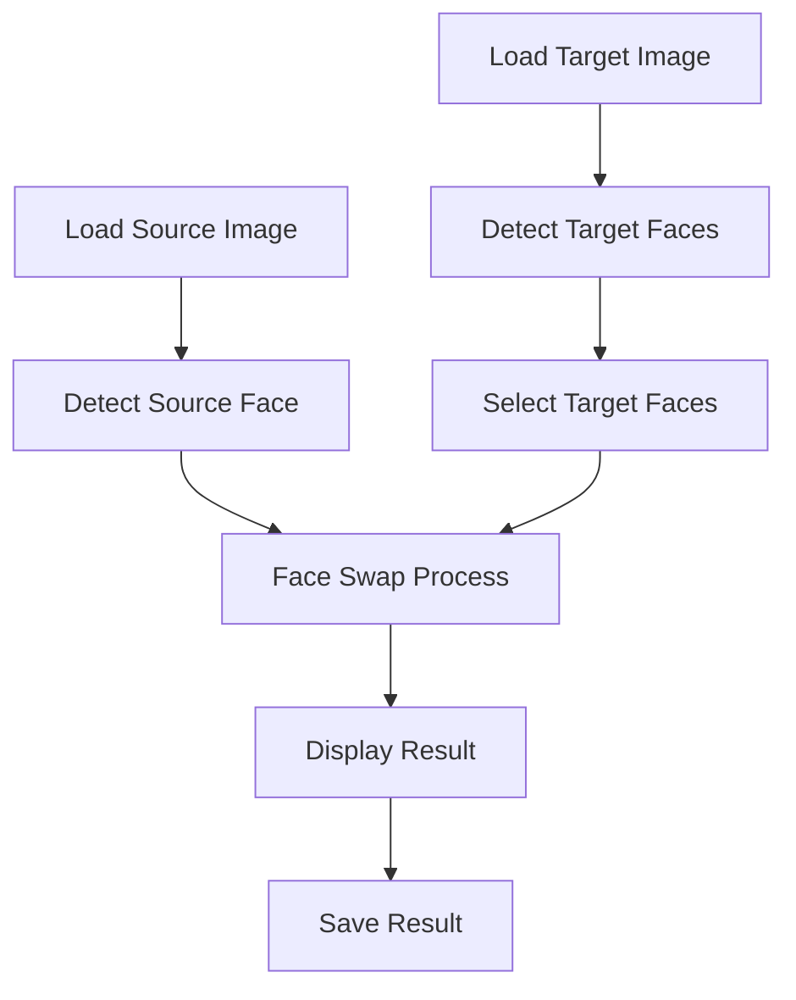
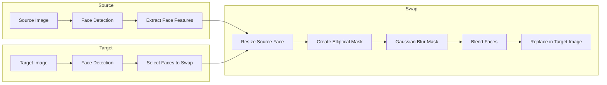
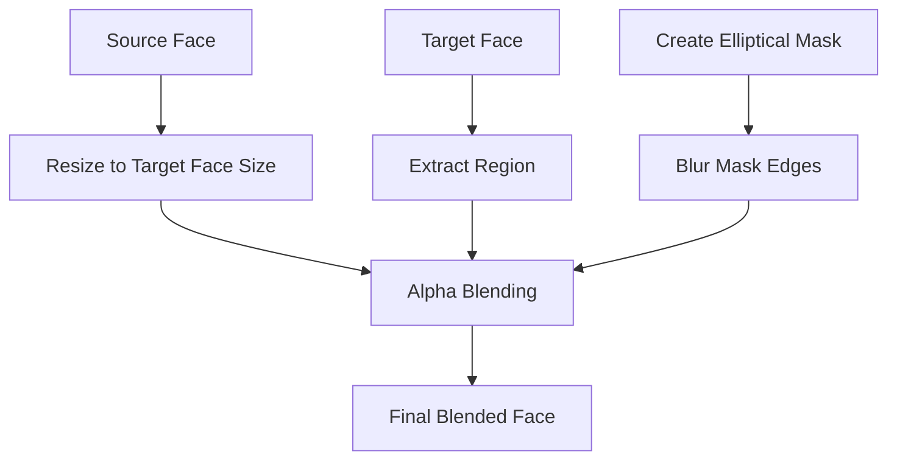

# Face Swap Application

A simple desktop application for swapping faces in images using computer vision techniques.

## Overview

This application allows you to swap a face from a source image onto one or more faces in a target image. It uses InsightFace for face detection and provides a user-friendly interface for loading, cropping, and processing images.

## How It Works

### The Basic Workflow

1. Load a source image containing the face you want to transplant
2. Load a target image containing the face(s) you want to replace
3. Detect faces in both images automatically
4. Select which face(s) in the target image you want to replace
5. Perform the face swap operation
6. Save the resulting image

### Technical Details

#### Face Detection

The application uses InsightFace's face analyzer to detect faces in images. InsightFace is a powerful, open-source facial analysis toolkit that can:

- Detect faces in images
- Extract facial landmarks
- Analyze facial features

When you click the "Detect Faces" button, the app processes both the source and target images to identify faces and draw bounding boxes around them.

#### Face Selection

After detection, you can click on any face in the target image to select it for swapping. Selected faces are highlighted with a red outline, while unselected faces have a green outline.

#### The Mathematics of Face Swapping

The face swapping process involves several key steps:

1. **Extraction**: The source face is extracted from its bounding box
2. **Resizing**: The source face is resized to match the dimensions of the target face
3. **Masking**: An elliptical mask is created to define the blending region
4. **Blending**: The source and target faces are blended using alpha blending

The alpha blending formula used is:

```
blended = (source_face * mask) + (target_face * (1 - mask))
```

Where:

- `source_face` is the resized source face
- `target_face` is the original face region in the target image
- `mask` is a 3-channel mask with values between 0 and 1

#### Smooth Blending

To create a natural-looking result, the application:

1. Creates an elliptical mask slightly smaller than the face region
2. Applies Gaussian blur to the mask edges for smooth transitions
3. Uses the blurred mask for alpha blending

This produces a gradual transition between the swapped face and the original image, reducing visible seams.

### Workflow Diagram



### Face Detection and Swapping Process



### Face Blending Process



## Requirements

- Python 3.6+
- OpenCV (cv2)
- NumPy
- InsightFace
- Pillow (PIL)
- tkinter (usually included with Python)
- CMake (for building dependencies)
- A C++ compiler (for building certain dependencies)

## Installation and Usage

### Installation

1. Make sure you have the necessary system dependencies:

```bash
# For Ubuntu/Debian
# ... not sure 😛

# For macOS
brew install cmake

# For Windows
# ... not sure 😛 either
```

2. Clone and install the application:

```bash
# Clone the repository
git clone https://github.com/MahammadNuriyev/faceswap.git
cd faceswap

# Install Python dependencies
pip install -r requirements.txt

# Run the application
python main.py
```

## Using the Application

1. **Load Source Face**: Click "Load Source Face" to select an image with the face you want to use
2. **Load Target Image**: Click "Load Target Image" to select an image with faces you want to replace
3. **Detect Faces**: Click "Detect Faces" to automatically detect faces in both images
4. **Select Target Faces**: Click on faces in the target image to select/deselect them
5. **Swap Faces**: Click "Swap Faces" to perform the face swap operation
6. **Save Result**: Click "Save Result" to save the final image

### Optional Features

- **Crop Source/Target**: Use these buttons to manually crop the images if needed
- The status bar at the bottom shows helpful information during the process

### Tips for Better Results

- Try to match the facial expression in your source image with the target face's expression
- If possible, use source and target images with similar lighting conditions
- Front-facing, neutral or similar expressions work best
- You may need to experiment with different source images if results aren't satisfactory

## Technical Notes

- The application uses an elliptical mask rather than a rectangular one for more natural blending
- Gaussian blur is applied to the mask edges to create smooth transitions
- The face detector works best with clear, unobstructed views of faces
